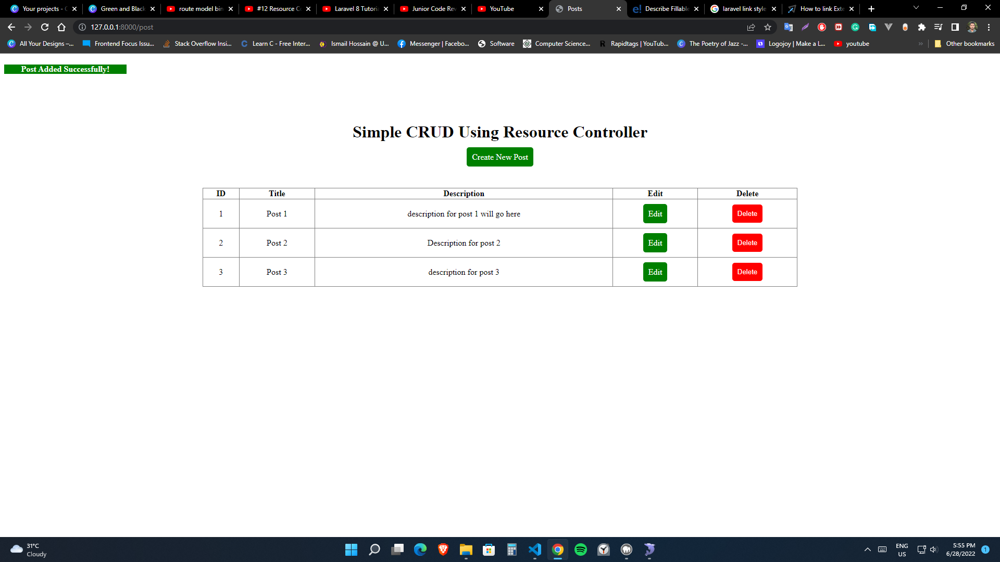
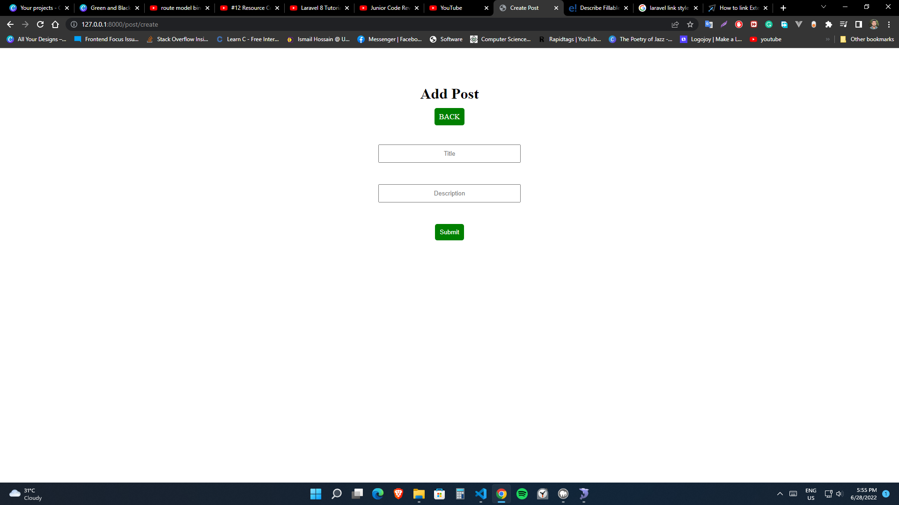

<h1>How to use</h1>
1. Create a database "resource_controller_crud" then import the resource_controller_crud.sql file.
2. download zip file or clone the project
3. rename .env.example to .env
4. open .env and update DB_DATABASE (database details)
5. run command : composer install
6. run command : php artisan key:generate
7. run command : php artisan serve
